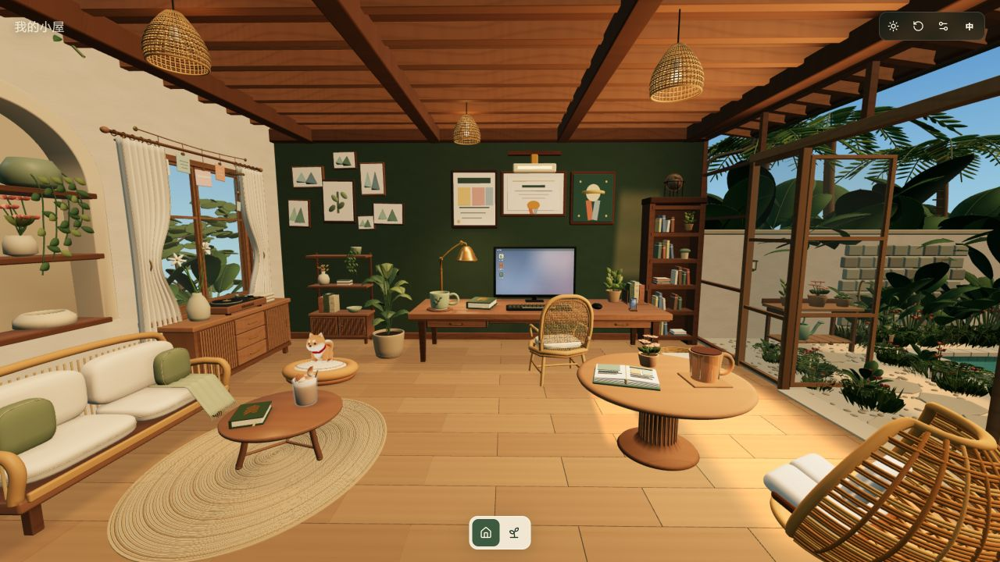
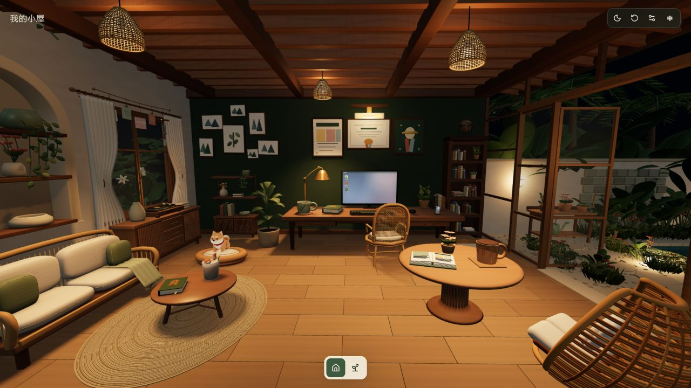
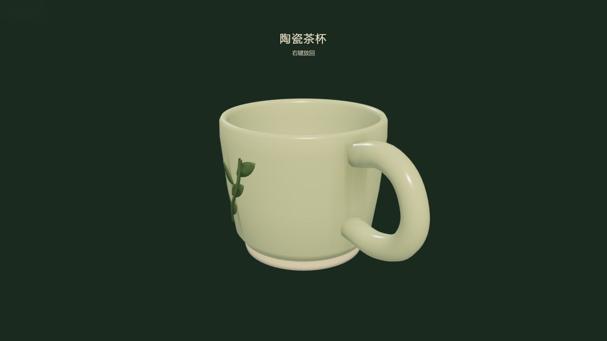
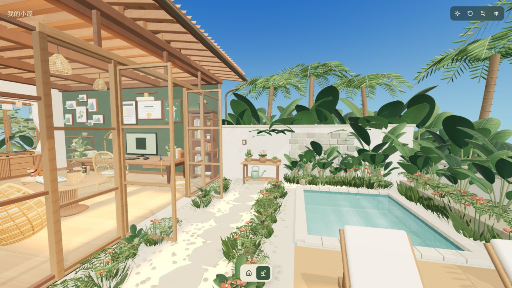
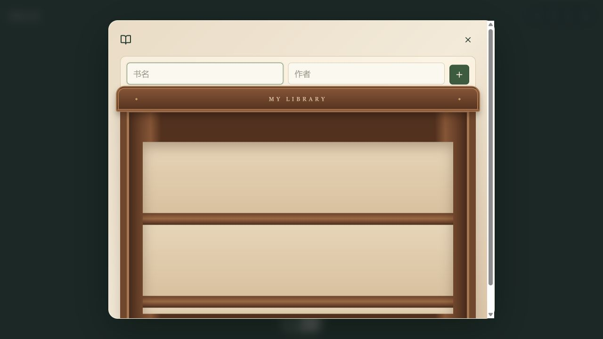
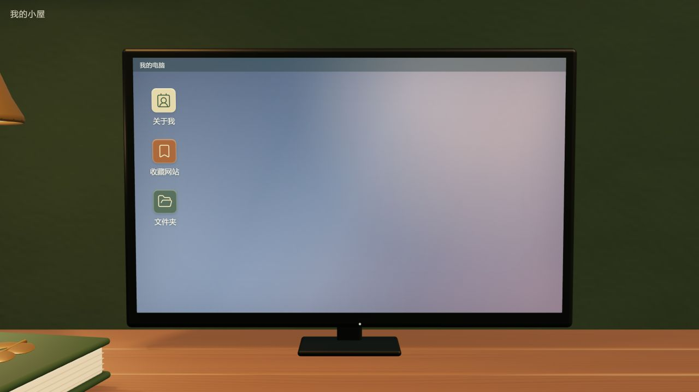

<div align="center">

# 我的小屋 · My Cozy Home

**一个可以被走进、凝视与慢慢填满的 3D 个人空间。**  
**A 3D personal space to enter, explore, and gradually make your own.**

[](https://react.dev/)
[](https://threejs.org/)
[](https://vite.dev/)
[](LICENSE)

</div>

> **所有配图均为本地运行的真实 WebGL 截图；不使用 AI 概念图或资产展示图。**  
> **Every image below is a live local WebGL capture—no AI concept art or standalone asset renders.**

<p align="center">
  
</p>

<p align="center"><sub>实际运行截图：白天的室内全景 · Live capture: interior overview in daylight</sub></p>

---

## 中文

### 这是什么？

“我的小屋”是一个基于浏览器的互动式 3D 个人空间样板。你从有屋顶的室内开始，在书桌、客厅与热带庭院之间切换镜头；靠近、拿起并查看物件；通过显示器进入自己的数字桌面。

这不是静态页面：场景由 React Three Fiber / Three.js 实时渲染，家具、植物、唱片机与宠物都处在可探索的三维空间中。个人资料、记录与收藏仅存于本机浏览器的 IndexedDB，不会上传到服务器。

<p align="center">
  
  
</p>

<p align="center"><sub>实际运行截图：夜晚氛围 · 拿起陶瓷茶杯查看<br />Live captures: night mood · ceramic-cup inspection</sub></p>

### 实机体验画廊 · Live interaction gallery

<p align="center">
  
</p>

<p align="center"><sub>庭院：泳池、种植台与热带绿植 · Garden: pool, potting bench, and tropical planting</sub></p>

<p align="center">
  
  
</p>

<p align="center"><sub>打开书架 · 打开电脑<br />Opened bookshelf · Opened computer</sub></p>

### 现在可以体验

| 区域 | 交互体验 |
| --- | --- |
| 🏡 室内与庭院 | 在同一连通场景中切换室内／室外镜头，经过门洞并保留屋顶、木梁、墙体与环境光。 |
| 🪑 可探索物件 | 点击家具或小物件自动靠近；茶杯、笔记本、盆栽、鼠标、茶几物件、盆栽与洒水壶可拿起旋转查看。 |
| 💻 屏幕内桌面 | 点击显示器进入个人数字桌面，可编辑昵称、介绍与兴趣，创建／搜索文字记录并添加收藏链接。 |
| 🎵 唱片角 | 靠近唱片机后可播放／暂停、调整音量与进度；唱片和唱臂会同步动作。内置一段原创合成示例曲。 |
| 🌤️ 日夜与氛围 | 白天有暖色日光与窗影；夜晚点亮吊灯、台灯、门廊与庭院小灯，并显示星空。 |
| 🐈 本地偏好 | 设置支持减少动态与文字桌面；小猫拥有 Idle / Walking 两种现有动画。 |

### 快速开始

**推荐：** 双击 [`启动小屋.cmd`](启动小屋.cmd)，保持启动窗口开启后访问 [http://127.0.0.1:5173/](http://127.0.0.1:5173/)。

或在项目目录运行：

```powershell
npm.cmd install
npm.cmd run dev
```

开发环境使用 Node.js 22。开发服务器固定监听 `127.0.0.1:5173`；请不要交替使用 `localhost`、IP 或其他端口，以免进入不同的浏览器本地存储空间。

### 操作提示

- 拖动鼠标或使用方向键小范围环顾；右上角可复位镜头。
- 点击物件靠近；在物件近景中选择“拿起查看”可旋转，`Esc` 放回。
- 点击显示器，或书桌近景中的“使用电脑”进入软件；`Esc` 依次关闭软件和退出电脑。
- 建议在手机横屏体验 3D 场景；竖屏时可在电脑模式选择“展开阅读”。

### 数据与隐私

资料、文字记录和收藏保存在当前浏览器的 IndexedDB 数据库 `my-cozy-home`。项目没有业务后端、账号、加密或云同步，**不会上传你的内容**。

目前还没有 ZIP 导入导出、跨设备同步或恢复机制。请不要把唯一的重要资料仅保存在样板中；更换浏览器／设备／访问地址，或清除站点数据都可能导致本地内容不可见。

### 后续计划

- 照片与纪念物、记录摆放和回忆册
- ZIP 备份、导入与恢复
- 植物成长与照顾系统
- 宠物喂食、抚摸、逗猫与趴睡动画
- 环境声音、移动端适配与性能验收

### 开发与检查

```powershell
npm.cmd run typecheck
npm.cmd test
npm.cmd run build
```

项目结构：`src/scene` 为场景与镜头，`src/desktop` 为屏幕内软件，`src/data` 为版本化本地数据与校验。素材与许可记录见 [ASSETS.md](ASSETS.md)，概念与交互约定见 [design/REVIEW.md](design/REVIEW.md)。

---

## English

### What is this?

**My Cozy Home** is a browser-based interactive 3D personal-space prototype. Begin inside a roofed room, move your view between the desk, living area, and tropical garden, inspect objects up close, and enter a digital desktop through the in-world monitor.

It is not a static page. The scene is rendered in real time with React Three Fiber and Three.js; its furniture, plants, turntable, and pets are explorable 3D elements. Profile data, notes, and links stay in your browser's IndexedDB and are never sent to a server.

### Available today

- **Connected home and garden** — switch interior/exterior viewpoints through the doorway while keeping the house structure, lighting, and garden together in one scene.
- **Object exploration** — approach furniture and inspect small items such as cups, notebooks, plants, a mouse, garden tools, and living-room objects in hand.
- **In-world desktop** — use the monitor to edit a profile, create and search text notes, and save favourite links.
- **Turntable corner** — play, pause, seek, and adjust volume while the record and tonearm animate; an original synthetic demo track is included.
- **Day/night mood** — warm daylight and window shadows by day, then practical lamps, garden lights, and stars at night.
- **Local preferences** — reduced-motion and text-desktop settings are supported; the cat currently has Idle and Walking animations.

### Run locally

**Recommended:** double-click [`启动小屋.cmd`](启动小屋.cmd), keep its terminal window open, then visit [http://127.0.0.1:5173/](http://127.0.0.1:5173/).

Alternatively, from the project directory:

```powershell
npm.cmd install
npm.cmd run dev
```

The project uses Node.js 22 and intentionally serves only on `127.0.0.1:5173`. Avoid swapping between `localhost`, an IP address, or other ports: each can have a separate browser-storage space.

### Controls

- Drag, or use the arrow keys, for a limited look-around; use the top-right reset control to recenter the view.
- Click an object to approach it. Choose “pick up to inspect” in close view, then press `Esc` to put it back.
- Click the monitor, or choose “use computer” at the desk, to open the desktop. `Esc` closes software first, then exits the computer.
- Landscape orientation is recommended for the 3D experience on phones. In portrait mode, select “expand reading” in computer mode.

### Privacy and data boundary

Profiles, notes, and bookmarks are stored in the current browser's `my-cozy-home` IndexedDB database. There is no application backend, account system, encryption layer, or cloud sync; **your content is not uploaded**.

This prototype does not yet provide ZIP import/export, cross-device sync, or recovery. Do not keep your only copy of important material here. Changing browsers, devices, or site addresses—or clearing site data—can make local content unavailable.

### Roadmap

- Photos, keepsakes, placeable memories, and a memory book
- ZIP backup, import, and recovery
- Plant growth and care
- Feeding, petting, play, and resting interactions for pets
- Ambient sound, mobile refinement, and performance validation

### Development checks

```powershell
npm.cmd run typecheck
npm.cmd test
npm.cmd run build
```

`src/scene` contains the scene and camera, `src/desktop` the in-world desktop, and `src/data` the versioned local-data layer. See [ASSETS.md](ASSETS.md) for assets and licenses, and [design/REVIEW.md](design/REVIEW.md) for the concept and interaction contract.

---

## Credits

The cat model is adapted from Quaternius’ **Animal Pack Vol. 2**, released under CC0. Detailed asset, transformation, and dependency notes are maintained in [ASSETS.md](ASSETS.md) and [THIRD_PARTY_ASSETS.md](THIRD_PARTY_ASSETS.md).

## License

This repository is released under the [MIT License](LICENSE).
