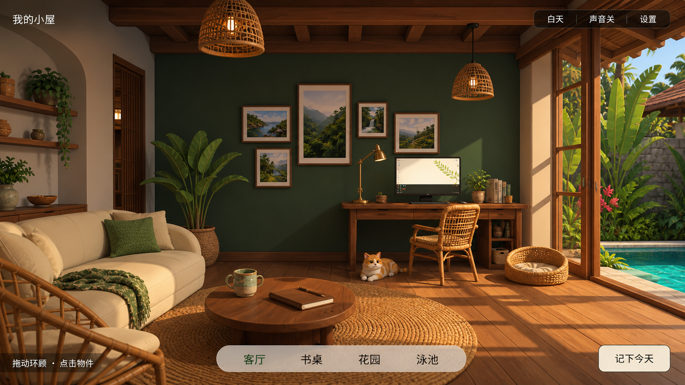
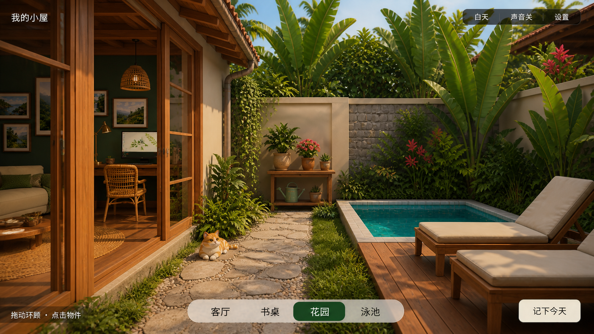
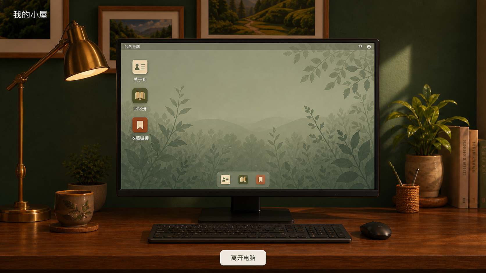
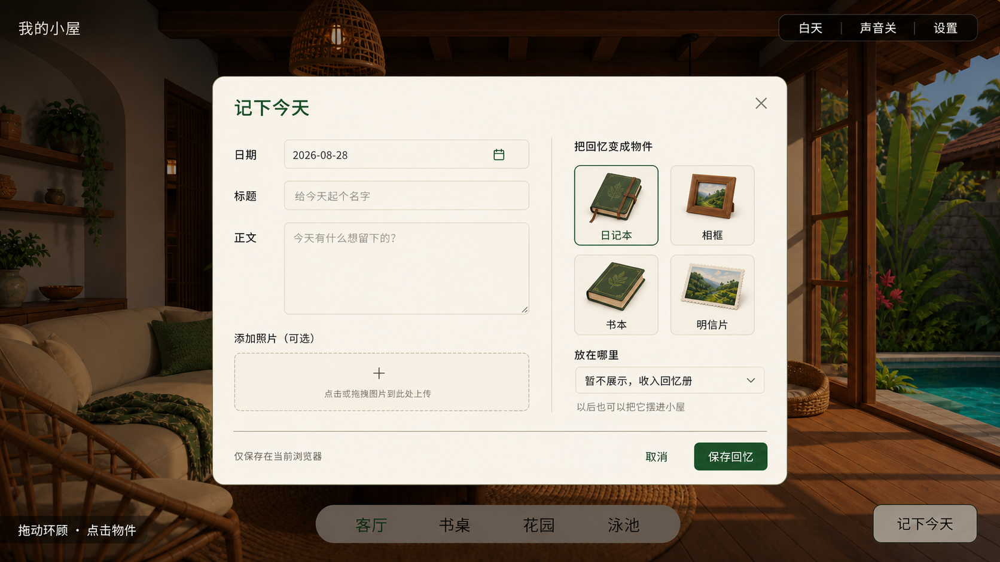

## 当前修订：站在屋内的宽视角与连通庭院

本次以用户图片 `C:/Users/xiaobowen/Desktop/4fe4604f75dc44cfdf29bc60f650d64c.jpg`（1179×750）为镜头和空间关系参考。上一轮把房间剖开、按区域卸载场景是误解，已撤销。房间、庭院和热带植被始终处于同一 Three 场景；切换只是镜头经过门洞，能够从两边互看。

对照检查：①镜头位于屋内且低于屋顶，非外部模型展示；②实体浅色天花板与木梁占画面上方；③深绿后墙、暖木家具、米色藤编保留；④主要家具形成前后层次，底部仍只有室内／室外；⑤窗门外可见真实几何植物与庭院；⑥电脑椅面向桌子，圆桌两椅面向桌心。音乐边柜调整为窗下短柜，与沙发、书架分开。

有意保留差异：此图用于视角关系，不复制作者资产、照片、人物、英文 UI 或视频播放按钮／字幕。继续使用本项目中文按钮与既有家具，新增热带棕榈、大叶植被、蕨类；不宣称写实植被或整屋逐像素复刻。窄屏保留屋内站位，不通过退到墙外来塞下整间房。

以下为历史记录，剖开式全景和360°行走都不再代表当前实现。

## 历史修订：正面有限环绕与唱片机（剖开方案已撤销）

按用户澄清，开场改为完整正面全景，围绕中心左右各约 20°，固定俯仰，不允许背面或点击地面走动。室内／室外两个入口不变，点击物品拉近、返回恢复原全景角度。近景依然是实际场景，不是图片。

移除前墙显示；屋顶只投影、不遮住剖开的室内。边柜移到左前方、餐桌移到右侧，全景可看到新增家具。唱片机为 Blender 原创几何，唱片和唱臂可动；默认静音，支持原创示例曲和本地文件。概念图的自然配色与材质方向保留；正面剖开构图是本次明确变更，不宣称精确复现未能打开的参考视频。

以下为历史阶段记录；其中自由行走、360° 和完整前墙的设计已撤销。

# 我的小屋 · 美术确认

状态：概念方向与“电脑屏幕内软件”方案已获用户确认。经过书桌、窗光与客厅修订，已扩展庭院入口、种植台、景观泳池与躺椅。当前仍是阶段性样板，不能视为概念图美术与完整功能已全部达标。

## 历史修订：扩建与自由环顾（已被下述正面方案替换）

用户要求替换此前四个固定视角。现在底部仅保留“室内／室外”，镜头在区域内水平环顾 360°，点击可通行空地移动；上下转动限制为约 ±16°，不会绕到屋顶外或俯冲脚底。室内天花板和地面仍作为真实空间自然可见，不使用隐形屋顶制造假室内。区域切换通过门洞，静态家具和泳池参与避障；近景保留物品在场景中的位置，小物件再通过“拿起查看”进入旋转检查。

建筑左界由 -4.8 扩至 -6.6，前界扩至 11.4，顶板由 4.34 抬至 5.5；家具不同比例放大。沙发、茶几、书架和窗边重新定位，新增 Blender 圆餐桌、两把藤椅、木条门板收纳边柜及完整前墙。转身不再看到空缺的建筑背面。猫咪与存档结构不变。

对照已确认室内概念检查：深绿墙与暖木、米白藤编家具、书桌和沙发的空间层次、窗框日光、少量界面入口。按用户本轮要求有意偏离原概念的固定镜头和地点名称，新增“点击空地移动／点击物品靠近”说明及近景操作。仍使用真实几何与数学材质，不宣称达到概念图写实植被或最终猫咪品质。以下各节为此前阶段记录，四地点交互已由本节取代。

## 庭院基础空间

按 `02-garden-v1.png` 对照五项：木框门连接室内、左侧石板与碎石小路、后方种植台、右侧小泳池、暖木与米白躺椅。模型均为真实几何；池壁、池底、压顶和小瓷砖分层构造，水面低于池沿，地面在池体处留出空腔。三类盆栽及空心洒水壶能拿起查看，门目前固定敞开。夜晚三盏庭院小灯提供局部暖光。程序植被、围墙细节及实时水面与概念的写实效果仍有差距，未以概念图替代网页验收。

新增“庭院／池畔”地点，室内外镜头通过门洞中间的安全点切换；减少动态时直接跳至目标镜头并暂停水波。后续不继续堆家具，先补照片、记录摆放和 ZIP 备份恢复，再进入植物养成，猫咪最后处理。此次未更改猫咪或用户存档结构。

2026-08-28 阶段验证：类型检查、生产构建及 37 项测试通过。实际浏览器检查了日夜、室内外往返、从池畔进入电脑并返回、软件点击、洒水壶旋转、花卉与多肉拿取、连续切换地点，以及 510×631、375×667 窄屏导航。Windows 本机内置浏览器、DPR 1.0 的短时页面采样：1672×941 庭院约 162 FPS / 534 次绘制，510×631 庭院约 163 FPS / 298 次绘制；不是独立 GPU 基准，也未在真实手机上测试，CPU/GPU 型号未取得。最终重载后无新运行错误，仍有依赖的 Three.Clock 弃用提示与构建大包提示。完整养成、照片和备份尚未实施，未宣称相关验收通过。

## 客厅角落

新增米白双人沙发、绿色靠枕与搭毯、圆木茶几、实体编织地毯和第二盏藤编吊灯。底部增加“书桌／客厅”地点入口，可点击沙发靠近；从客厅进入电脑后离开会恢复原客厅镜头。茶几杯子和书可独立拿取。新增几何测试检查地面与地毯支撑、茶杯托底面、窗墙间距及原猫咪路线净空；猫咪模型、动作、路线均未更改。

此阶段仅扩展空间、照明和基本交互，不新增存档字段或照片备份功能。其后庭院基础空间已按上节接入；记录具象化和植物养成仍待制作，猫咪最后处理。

## Blender 精修轮

窗光与材质修订：左墙改为真实窗洞，增加木窗台和实体褶帘；窗外增加近处枝叶与远处丘陵。地板和顶板统一木材色差并使用抗锯齿数学木纹，墙面采用细微灰泥起伏；挂画重新组成主次组合。日光、窗侧补光、台灯和吊灯的照明分别调整，夜间用局部暖光与低强度反射补光。猫咪保持原状，未扩展客厅或庭院功能。

本轮对照 `01-interior-v2.png` 检查五项：深绿墙面色调、暖木板材、米白织物、挂画主次、日光与灯光方向。保留真实 3D 几何而非照片的约束；目前仍是独立书桌角落，风景浮雕、程序植被及猫咪与完整概念有差异，未宣称达到概念图写实程度。界面可见文字未增加或改名。

后续标注修订：右侧装饰书改成带底座和两侧书挡的整体模型，校准书底与桌面的支撑；左侧早期薄层板替换为有柜脚、柜门、立柱和托架的完整木架，并增加陶器、垂蔓、陈设书和有实体叶脉的落地植物。新增资产均由本机 Blender 原创建模，未使用照片贴图；不扩展房间范围或增加新的记录功能。

替换了桌、藤椅、杯、台灯、小盆栽、吊灯和山水装饰。模型包含真实倒角、织带厚度、坐垫曲面、杯内腔、灯罩内壁与浮雕；房间和拿取视图共用原模型。源文件见 `blender/cozy-desk-atelier.blend`。

保留用户确认的较小显示器与真正的深度遮挡；电脑近景改用更窄的视角并后移镜头，减少键盘的近大远小与裁切。窄窗口会适当拉远房间镜头，并缩小拿取物件的展示尺度。

本轮不更换猫咪、不扩展房屋和庭院、不增加养成/数据功能。概念图的写实植被、猫咪外形与整体光影仍不是已验收成果；墙上山水特意采用几何浮雕而非照片，以遵守用户尽量采用真实 3D 物件的要求。界面文字与功能入口没有新增或改名。

## 01 室内全景

推荐方向：深绿灰泥墙、暖木梁与地板、米白布艺、藤编家具、窗边电脑、橘白猫。保留真实可环顾的空间比例，不使用整张图片冒充 3D。

## 02 花园与泳池

木框玻璃门连接室内；左侧干燥活动小路，中部种植台，右侧小泳池与躺椅。猫咪不进入泳池。

## 03 电脑小桌面

点击电脑，镜头靠近书桌，在实体显示器屏幕内操作“关于我、回忆册、收藏链接”三个软件。不是悬浮在房间上的大面板，不读取真实电脑。

软件窗口、搜索、记录与编辑都留在显示器边框内；关闭软件回到电脑桌面，“离开电脑”返回房间。详见 [电脑软件交互修订](DESKTOP-INTERACTION.md)。

## 04 记录面板

日期、标题、正文、可选照片；选择日记本、相框、书本或明信片，再选择摆放位置或仅收入回忆册。

## 确认时需知道的边界

- 本组图片均为内置 image_gen 的概念图，不是已经实现或测试的网页。
- 图片中的高密度藤编、植被和光影必须在书桌角落 3D 样板中验证，不能预先承诺逐像素复现。当前猫采用 CC0 骨骼样本，只有待机与行走；与概念图圆润橘猫的外形仍有差距，不能认定为最终宠物资产。
- 生成图之间的细微状态差异不进入实现：导航选中态统一使用庭院图中的深绿色底；进入电脑模式或打开独立记录面板时，隐藏场景操作栏并禁用其输入。电脑内软件始终裁切在显示器可视区域内。
- 概念里的风景画与盆栽不代表用户记录；实际应用个人资料为空，演示内容明确标注。
- 图片参考原始尺寸均为 1672 × 941；实际网页还须验证电脑和手机布局。
- 记录面板右侧缩略图是概念，不能裁切整张概念图作为网页 UI；实施时生成独立资产或由对应 3D 模型生成预览。

## 下一步

打开 http://127.0.0.1:5173/ 体验室内与庭院样板。下一阶段先完成照片、纪念物摆放与本地备份，让小屋开始承载真实记录，再做植物与宠物养成。用户追加的“实物尽量以几何体制作、可拿起旋转”见 [物件交互修订](OBJECT-INTERACTION.md)。画框采用几何浮雕，杯、书、盆栽、鼠标、洒水壶支持查看；不使用整张概念图充当背景或页面。

初版提示词见 [PROMPTS.md](PROMPTS.md)，电脑修订提示词见 [DESKTOP-PROMPTS.md](DESKTOP-PROMPTS.md)。

## 当前修订：木顶、屋檐、拱形壁龛与雨林庭院

本轮按 1672×941 室内／庭院参考图落实标注区域，不复制概念图的旧导航或图片资产。对照结果：①浅色顶棚替换为有板缝的暖木顶，粗梁、细椽层级清楚；②屋顶伸过玻璃门，室内外都能看到檐底、椽尾、瓦缘与排水管；③左墙新增有真实前后深度的拱形壁龛，含木层板、陶器、收藏盒与垂吊植物；④庭院镜头位于连接小路上，左侧房间可见、右侧泳池与躺椅仍在；⑤石板路两侧保留通行宽度并加入错落的蕨类、低草与花簇；⑥泳池后方由地被、蕨类、大叶植物和棕榈形成高低层次。家具、电脑屏幕中文软件、室内／室外两按钮与猫咪行为均保持原方案。

有意保留差异：概念图是写实气氛参考，网页继续使用原创、无贴图、风格化三维几何，植物不采用带透明边缘的照片卡片；因此叶片细节和光照不会逐像素一致。本轮不进入猫咪、记录摆放或备份功能。

## 当前修订：昼夜光影与可读细节

针对浏览器标注完成五项修订：①壁龛垂蔓减少叶片重叠，近景能辨认细藤和单片心形叶；②米白花瓶加入七枝珊瑚色实体鲜花；③窗帘加长并增加褶皱、束带、侧缝与底摆；④白天改为蓝天、暖色直射阳光和清晰窗框投影，左窗增加多层山丘和树木，右侧仍显示连通庭院；⑤夜晚降低环境曝光，以三盏吊灯、台灯、唱片角、门廊和六盏庭院灯形成独立暖光区，加入实时星空。电脑屏幕换成更完整的山谷湖面壁纸，中文软件与交互不变。
